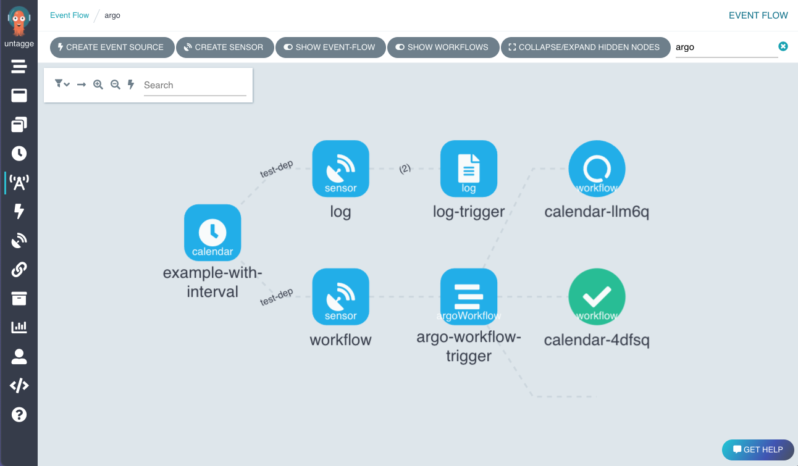

# Argo Events - The Event-driven Workflow Automation Framework

### [View all Roadmaps](https://github.com/nholuongut/all-roadmaps) &nbsp;&middot;&nbsp; [Best Practices](https://github.com/nholuongut/all-roadmaps/blob/main/public/best-practices/) &nbsp;&middot;&nbsp; [Questions](https://www.linkedin.com/in/nholuong/)
 

## What is Argo Events?

**Argo Events** is an event-driven workflow automation framework for Kubernetes. It allows you to trigger 10 different
actions (such as the creation of Kubernetes objects, invoke workflows or serverless workloads) on over 20 different
events (such as webhook, S3 drop, cron schedule, messaging queues - e.g. Kafka, GCP PubSub, SNS, SQS).

## Features

* Supports events from [20+ event sources](https://github.com/nholuongut/argo-events/concepts/event_source/)
  and [10+ triggers](https://github.com/nholuongut/argo-events/concepts/trigger/).
* Ability to customize business-level constraint logic for workflow automation.
* Manage everything from simple, linear, real-time to complex, multi-source events.
* [CloudEvents](https://cloudevents.io/) compliant.

## Try Argo Events

[Access the demo environment](https://workflows.apps.argoproj.io/event-flow/argo?showWorkflows=true) (login using
GitHub)

## Getting Started

Follow these [instructions](https://github.com/nholuongut/argo-events/installation/) to set up Argo Events.

## User Interface/API

The Argo Workflows has an API and user interface support Argo Events.

## Documentation

- [Concepts](https://github.com/nholuongut/argo-events/concepts/architecture/)
- [Argo Events in action](https://github.com/nholuongut/argo-events/quick_start/)
- [Deploy event-sources and sensors](https://github.com/nholuongut/argo-events/eventsources/setup/webhook/)
- [Deep dive into Argo Events](https://github.com/nholuongut/argo-events/tutorials/01-introduction/)

* TGI Kubernetes with Joe
## Who uses Argo Events?

[Official Argo Events user list](USERS.md)

## Contribute

Participation in the Argo Events project is governed by
the [CNCF Code of Conduct](https://github.com/nholuongut/foundation/blob/main/code-of-conduct.md).

[Contributions](https://github.com/nholuongut/argo-events/issues) are more than welcome, if you are interested take a look
at our [Contributing Guidelines](./docs/CONTRIBUTING.md).

## Security

Please see [SECURITY.md](https://github.com/nholuongut/argo-events/blob/main/SECURITY.md)

# 🚀 I'm are always open to your feedback.  Please contact as bellow information:
### [Contact ]
* [Name: Nho Luong]
* [Skype](luongutnho_skype)
* [Github](https://github.com/nholuongut/)
* [Linkedin](https://www.linkedin.com/in/nholuong/)
* [Email Address](luongutnho@hotmail.com)
* [PayPal.me](https://www.paypal.com/paypalme/nholuongut)

# License
* Nho Luong (c). All Rights Reserved.🌟